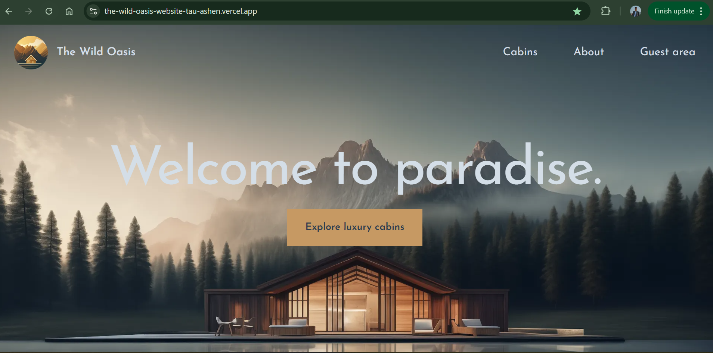
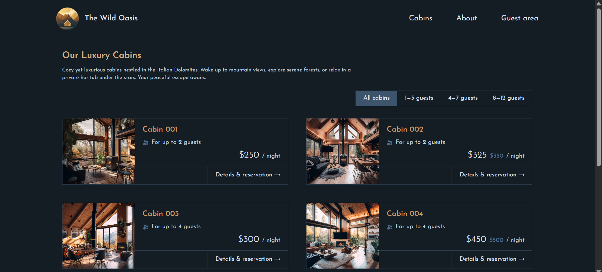
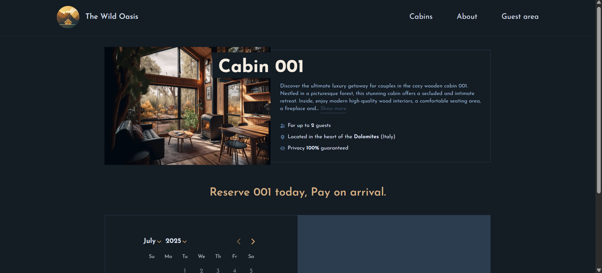
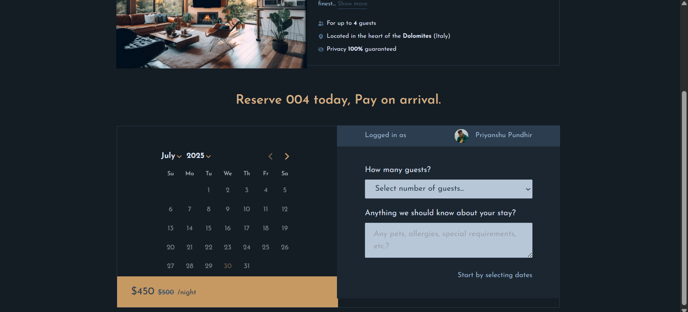
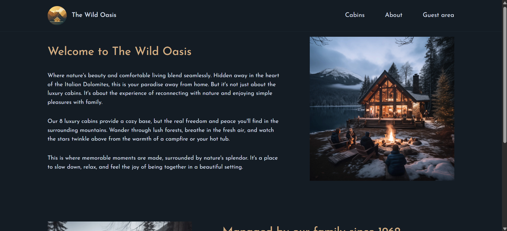
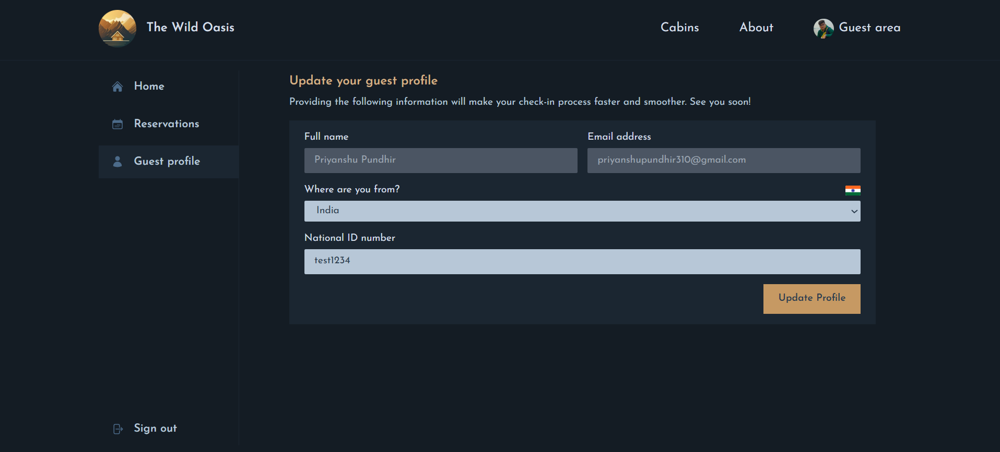
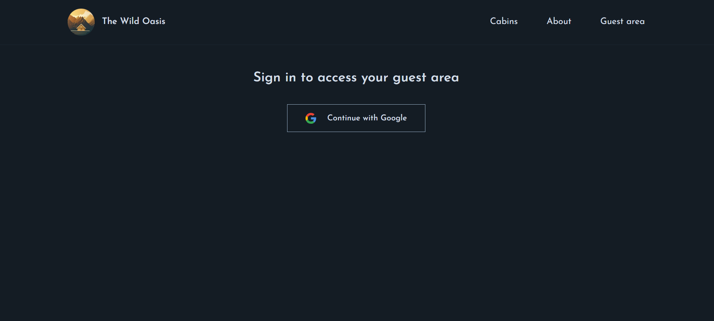
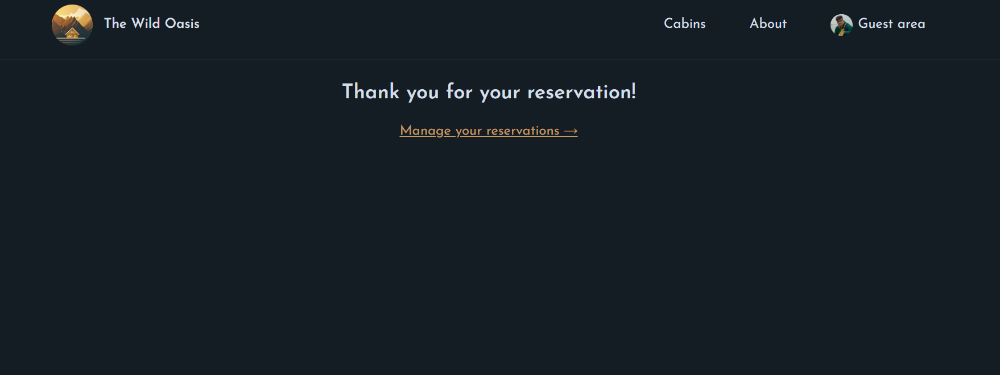

# 🏡 Villa Booking Website

A modern, full-stack **villa reservation platform** built with **Next.js 14**, **Supabase**, and **Vercel**. 

## 🚀 Try It Out

🌐 **Live Demo:** [Click here to explore the app](https://the-wild-oasis-website-tau-ashen.vercel.app/)

> Login via **Google** to make a reservation and access full features!

## 📸 Screenshots

   
  <strong>Homepage</strong>

 

   
  <strong>Villa details page with booking options</strong>

 

   
  <strong>Booking interface</strong>

 

   
  <strong>Calendar showing available dates for villa reservation</strong>

 

   
  <strong>About US Page</strong>

 

   
  <strong>User Settings</strong>

 

   
  <strong>View see all your past/upcoming reservations</strong>

 

   
  <strong>Google login and secure route protection using NextAuth</strong>

   
  <strong>Thank you page after Reservation</strong>

## ✨ Features

- 🔐 Google Authentication via **NextAuth**
- 💾 Backend powered by **Supabase**
- 🖼️ **Image Optimization** with Next.js
- ⚡ **Suspense**, **Server Actions**, and **Caching with Revalidation**
- 🎨 Fully responsive UI with **Tailwind CSS**
- 🧠 Smart use of **React Hooks** and **Middleware**
- 🌍 Deployed seamlessly on **Vercel**

## 🛠️ Tech Stack

- **Framework**: Next.js (App Router, Server Components)
- **Backend**: Supabase (Auth, Database)
- **Auth**: NextAuth.js with Google Provider
- **Styling**: Tailwind CSS
- **Deployment**: Vercel

